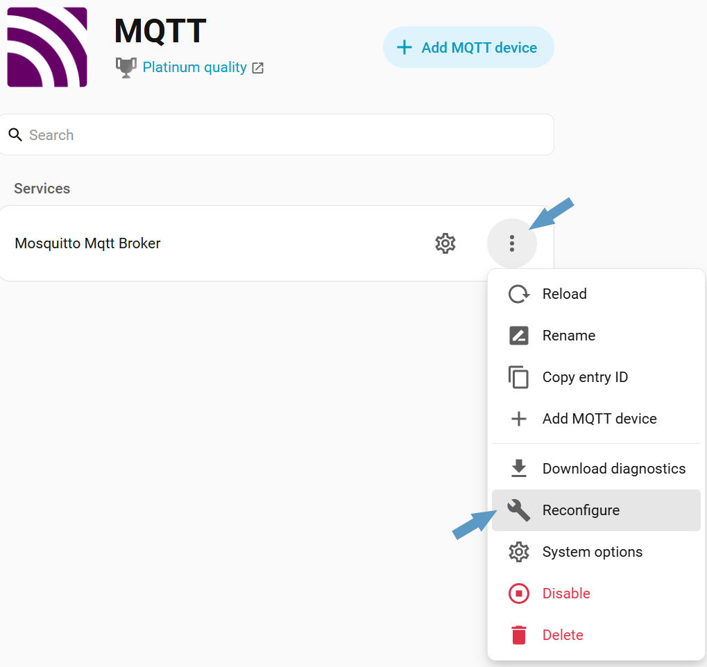
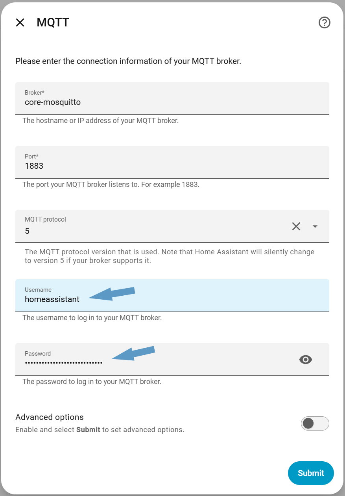
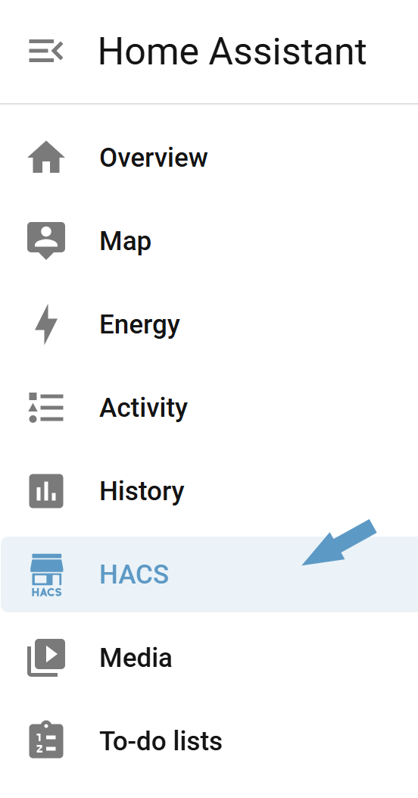
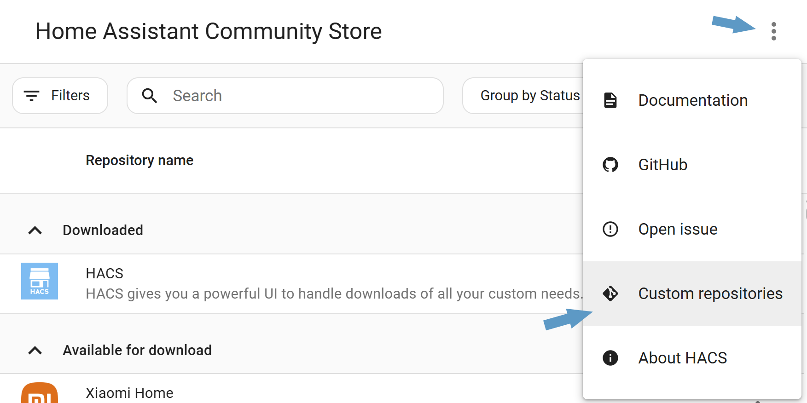
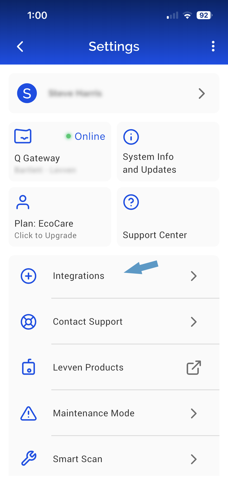
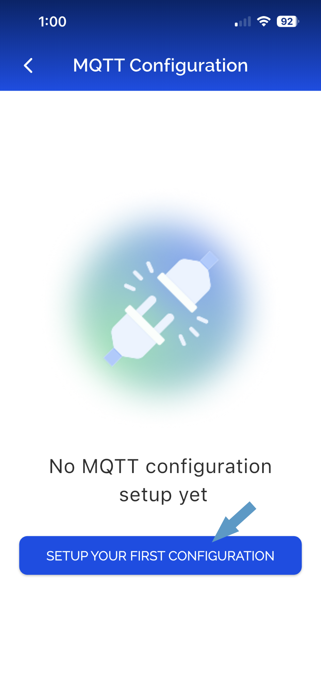
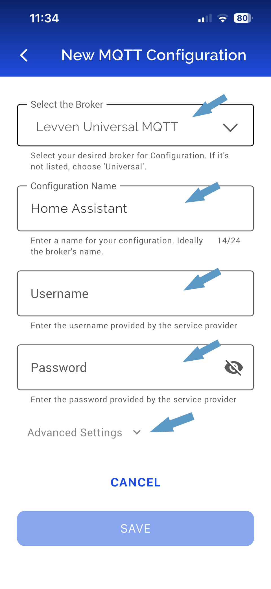
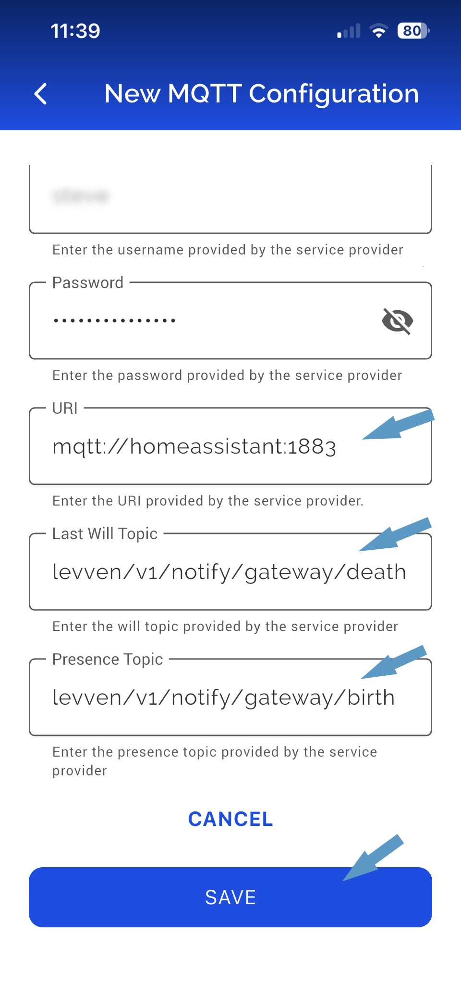
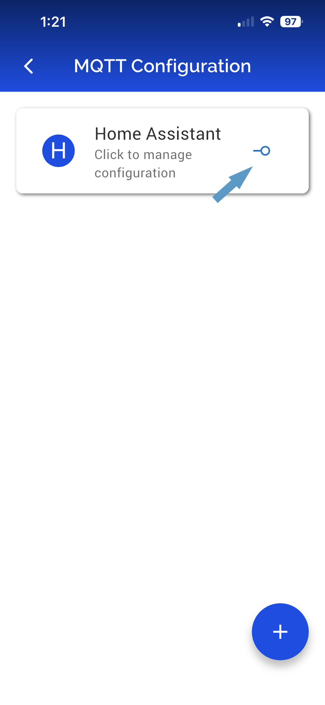
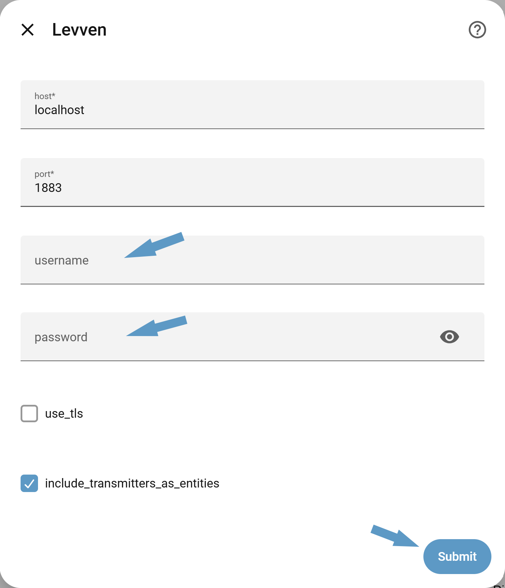

# Levven Home Assistant Integration

Home Assistant integration for Levven devices connected through a Levven Q Gateway, maintained in the `levven-com/home-assistant-levven` repository (developed by `@jvsinclair`).

[](https://hacs.xyz/)
[](https://github.com/levven-com/home-assistant-levven/releases)

[](https://github.com/levven-com/home-assistant-levven/stargazers)

This integration enables Home Assistant to control and monitor Levven devices via the [Levven Q Gateway](https://levven.com/shop/q-gateway-67) using MQTT.

## Features

- **Automatic Device Discovery**: Automatically discovers all receivers (controllers) connected to your Levven Q Gateway
- **Light Control**: Full support for dimmable lights with brightness control (Levven level 0-65535 mapped to HA brightness 0-255)
- **Switch Control**: Support for on/off switches and outlets
- **Real-time Updates**: State changes are reflected immediately via MQTT notifications
- **Switch Events**: Transmitter (switch) presses trigger Home Assistant events for automation
- **Device Management**: Automatic handling of device additions and removals

## Installation

If you do not have a Home Assistant installation, follow the [Home Assistant installation guide](https://www.home-assistant.io/installation/) to set it up. This setup guide is based on the [Raspberry Pi Home Assistant installation](https://www.home-assistant.io/installation/raspberrypi).

Install the Levven app on your mobile device.

[](https://apps.apple.com/ca/app/levven-controls/id1436898660)
[](https://play.google.com/store/apps/details?id=com.levven.controls)

Before installing the integration in Home Assistant, it is **strongly recommended** that you:

- Set up your Levven devices (gateway, power controllers, switches) in the Levven app.
- Give each device a meaningful name in the Levven app.

While renaming is supported on the Home Assistant side, doing most of your naming in the Levven app first reduces the chance of name/ID churn that can affect automations and other features in Home Assistant.

For additional information on installing and using your Levven Controls app to configure your Levven devices, see the [Levven Controls App Support page](https://levven.com/support/levven-controls-mobile-app).

### Home Assistant MQTT integration

If you have not previously installed the Home Assistant MQTT integration, follow the [Home Assistant MQTT guide](https://www.home-assistant.io/integrations/mqtt/).

#### If using the Home Assistant provided Mosquitto broker additional configuration is required:

1. Go to **Settings → Devices & Services → MQTT**.
1. Click the three dots menu and select **Reconfigure**.

   

1. Change user name from `homeassistant` to your login name and update password to your Home Assistant password. These will become your MQTT credentials. Then click **Submit**

   


### HACS

If you have not previously installed the HACS Home Assistant integration, follow the [Start using HACS](https://hacs.xyz/docs/use/) guide on the HACS website. 

The Levven Home Assistant integration can be installed through HACS as a custom repository:

1. Open HACS in Home Assistant (if not visible do a deep browser refresh).

   

1. Click the three dots menu and select **Custom repositories**.

  <kbd>
   
  </kbd>

1. Add this repository URL: `https://github.com/levven-com/home-assistant-levven`.
1. Set the type to **Integration** and add.
1. Search for **Levven** in HACS, select it and click **Download** to install it.
1. Restart Home Assistant.

> **Note**: HACS itself requires that the repository has this `README.md` at the **root** of the repo, plus `hacs.json` in the root, and the integration code under `custom_components/levven/`

## Configuration

#### Levven app MQTT configuration

1. In your Levven mobile app select the gear icon in the upper right hand corner of the Levven mobile app to open the settings screen then tap **Integrations**

   

1. If no integrations are configured your screen will look like the screen on the left. In which case tap **SETUP YOUR FIRST CONFIGURATION**. Otherwise tap the existing connection as shown on the right and continue to the next step.

   
   

1. On the **MQTT Configuration** page be sure the that **Levven Universal MQTT** broker is selected. Give your connection a useful name such as **Home Assistant**. Enter your **Username** and **Password** as configured earlier in your **Home Assistant** configuration. Then expand **Advanced Settings**.

   

1. Set the **URI** field to be `mqtt://homeassistant:1883`, unless you configured an external broker, in which case use a **URI** appropriate for your broker. Also update the **Last Will Topic** to be `levven/v1/notify/gateway/death` and the **Presence Topic** to be `levven/v1/notify/gateway/birth`. Then tap **Save**.

   

1. Ensure that the integration is enabled. If the toggle symbol is pointing to the right that means it is disabled, in which case tap it so that it points to the left as in the image below.

   


### Home Assistant Levven Integration Setup

1. In **Home Assistant** Go to **Settings → Devices & Services → Add Integration**.
1. Search for **Levven**.
1. Enter your MQTT broker details and then click **Submit**:
   - **Host**: MQTT broker hostname or IP address (leave as `localhost` if using Home Assistant provided Mosquitto broker)
   - **Port**: MQTT broker port (leave as `1883` if using Home Assistant provided Mosquitto broker)
   - **Username**: Use same Username as configured in MQTT broker and Levven app.
   - **Password**: Use same Password as configured in MQTT broker and Levven app.
   - **Use TLS**: Enable if your broker uses TLS
   - **Transmitters as entities**: When enabled, each newly discovered Levven switch (transmitter) will be added as an entity.
      - You can then attach automations to each button (up and down) using the `levven_switch_pressed` event and the per-transmitter state, giving fine-grained control per physical button. This does not affect configuration in the Levven app. If you need to change switch-to-controller mapping, we recommend doing that in the Levven app.

   

1. The integration will automatically discover your gateway and all connected receivers.

### Levven Q Gateway and device presence (MQTT + mDNS fallback)

Gateway availability is primarily tracked via **MQTT birth/death topics**, with **mDNS** used as a fallback:

- When the Levven Q Gateway connects to MQTT it publishes to the Presence Topic (`levven/v1/notify/gateway/birth`), which the integration treats as “gateway online”.
- When the gateway disconnects unexpectedly, the broker publishes the configured Last Will Topic (`levven/v1/notify/gateway/death`), which the integration treats as “gateway offline”.
- Additionally, the gateway advertises itself on the local network via mDNS (`_lcap._tcp.local.`); the integration uses this as a secondary signal and fallback if MQTT presence is not configured.

Per-device reachability is tracked via MQTT:

- The integration subscribes to `levven/v1/notify/receiver/status` and uses the `reachable` flag in that payload to mark each receiver as available/unavailable.

## Supported Devices

For an overview of all Levven devices as well as detailed specifications and images of each supported device, refer to the [Levven shop](https://levven.com/shop), such as:

### Receivers (Controllers)

#### Dimmable Receivers (Light Entities)
- **Type 4**: [GPDT15 – 1.5A Dimmer Power Controller](https://levven.com/shop/1-5a-dimmer-power-controller-90)
- **Type 5**: [GPC20 – 20A On/Off Power Controller](https://levven.com/shop/20a-on-off-power-controller-91)
- **Type 13**: CP2-4-5 Channel 1 – configurable as dimmer or on/off (part of the [CP2-4D-5 3.5A Dual Output Power Controller](https://levven.com/shop/category/power-controllers-2)); see Configuration below

#### On/Off Receivers (Switch Entities)
- **Type 3**: [GPC10 – 10A On/Off Power Controller](https://levven.com/shop/10a-on-off-power-controller-77)
- **Type 8**: [CP1-4 – 1.5A On/Off/Dimmer Power Controller](https://levven.com/shop/cp14d-111)
- **Type 14**: CP2-4-5 Channel 2 (part of the [CP2-4D-5 3.5A Dual Output Power Controller](https://levven.com/shop/category/power-controllers-2))

### Transmitters (Switches)

Transmitters (switches) can be exposed as entities (if enabled during setup) and fire events when pressed:

- **Type 2** (models made up to 2022), for example:
  - [CSDW – Decorator-Style Switch](https://levven.com/shop/csdw-79)
  - [CSQW – Designer-Style Switch](https://levven.com/shop/csqw-70)
  - [PSW – Portable-Style Switch](https://levven.com/shop/psw-99)
- **Type 10** (models made in 2022 and later): CSxyH22 variants (designer-style switches with updated radio hardware)
  - [CSDWH22 – Decorator-Style Switch](https://levven.com/shop/csdw-79)
  - [CSQWH22 – Designer-Style Switch](https://levven.com/shop/csqw-70)

## Entity Type Configuration

### Configuring CP2-4-5 Channel 1 Entity Type

Device type 13 (CP2-4-5 Channel 1) can be configured as either a dimmer (light) or on/off (switch) in the Levven app. By default, Home Assistant will detect the entity type based on whether the device reports a brightness level. However, you can manually configure the entity type using the `levven.set_entity_type` service:

```yaml
service: levven.set_entity_type
data:
  entity_id: light.levven_device_name  # or switch.levven_device_name
  entity_type: light  # or "switch"
```

After calling this service, you'll need to reload the Levven integration for the change to take effect. The preference is stored in the entity registry and will persist across restarts.

**Note**: The entity type configuration in Home Assistant is independent of the Levven app configuration. Make sure both are set correctly for your use case.

## Usage

### Controlling Lights

Lights can be controlled through Home Assistant's UI or via automations:

```yaml
# Turn on light at 50% brightness
service: light.turn_on
target:
  entity_id: light.levven_light_name
data:
  brightness: 128  # 50% of 255
```

### Controlling Switches

Switches can be toggled on/off:

```yaml
service: switch.turn_on
target:
  entity_id: switch.levven_switch_name
```

### Switch Press Events

When a Levven transmitter (switch) is pressed, it fires a `levven_switch_pressed` event that can be used in automations:

```yaml
automation:
  - alias: "React to Levven Switch Press"
    trigger:
      platform: event
      event_type: levven_switch_pressed
      event_data:
        tuid: "00000001"  # Optional: specific switch
    action:
      - service: light.toggle
        target:
          entity_id: light.example_light
```

Event data includes:
- `tuid`: Transmitter UID
- `is_on`: Current switch state (`true` / `false`)
- `gateway_id`: Gateway ID

## Device Discovery

The integration automatically discovers devices when:
- The integration is first set up
- A new receiver is added to the gateway (via `notify.receiver.new` notification)
- Home Assistant is restarted

Devices are automatically removed when:
- A receiver is deleted from the gateway (via `notify.receiver.delete` notification)

## Troubleshooting

### Devices Not Appearing

1. Check that your MQTT broker is running and accessible.
2. Verify the gateway is connected to the MQTT broker.
3. Check Home Assistant logs for errors.
4. Ensure the gateway has receivers configured.

### State Not Updating

1. Verify MQTT notifications are being received (check MQTT broker logs).
2. Check that the gateway is publishing to the correct topics.
3. Review Home Assistant logs for MQTT subscription errors.

### Connection Issues

1. Verify MQTT broker host and port are correct.
2. Check firewall settings if using a remote broker.
3. Ensure MQTT credentials are correct.
4. For TLS, verify certificates are valid.

## Technical Details

### MQTT Topics

The integration uses the following MQTT topics (as defined in the gateway's MQTT-RPC bridge):

**Command Topics (Subscribers):**
- `levven/v1/gateway/getinfo` - Get gateway information
- `levven/v1/receivers/list` - List all receiver UIDs
- `levven/v1/receiver/getinfo` - Get receiver information
- `levven/v1/onoff/set` - Set on/off state
- `levven/v1/level/set` - Set brightness level
- `levven/v1/onoff/get` - Get on/off state
- `levven/v1/level/get` - Get brightness level

**Notification Topics (Publishers):**
- `levven/v1/notify/gateway/info` - Gateway info updates (includes `gwid`, name, etc.)
- `levven/v1/notify/level` - Brightness level changes
- `levven/v1/notify/onoff` - On/off state changes
- `levven/v1/notify/receiver/new` - New receiver added
- `levven/v1/notify/receiver/delete` - Receiver removed
- `levven/v1/notify/receiver/info` - Receiver info updates (name/type/level/dimmable)
- `levven/v1/notify/receiver/status` - Receiver availability (`reachable` flag used for HA availability)
- `levven/v1/notify/transmitter/onoff` - Transmitter press events (used for `levven_switch_pressed` HA events)

For full functionality, the gateway should be configured to publish **all** of the above notification topics to your MQTT broker.

### Brightness Mapping

Levven devices use a 0-65535 scale for brightness, while Home Assistant uses 0-255. The integration automatically converts between these scales:
- Levven 0-65535 → HA 0-255
- HA 0-255 → Levven 0-65535

## Limitations

The following features are not yet supported (require gateway firmware updates):

- **Transmitter Discovery**: No automatic discovery of transmitters (switches)
- **Advanced Switch Events**: Hold/dim events are not exposed via MQTT
- **Pairing Mode**: No service to initiate gateway pairing mode
- **Transmitter Info**: No way to get transmitter names or details

## Support and Contributions

This integration is provided as-is for use with Levven Electronics devices.

Issues and pull requests are welcome, but this repository is maintained on a best-effort basis. Levven does not guarantee response times, support availability, or acceptance of proposed changes. For commercial support, contact Levven through normal support channels.

For issues, feature requests, or questions:

- Open an issue on the GitHub repository: `https://github.com/levven-com/home-assistant-levven/issues`
- Include **logs with debug enabled** and **screenshots** where relevant to help us diagnose problems quickly.

To enable debug logging for this integration, add the following to your `configuration.yaml`:

```yaml
logger:
  default: info
  logs:
    custom_components.levven: debug
```

Then:

1. Restart Home Assistant.
2. Reproduce the issue (for example, by running the failing flow again).
3. Go to **Settings → System → Logs** and download or copy the relevant entries for `custom_components.levven`.
4. When filing the GitHub issue, include:
   - A short description of what you were doing.
   - The exact error messages and stack traces from the logs (redact any secrets such as hostnames or credentials).
   - Screenshots of the **Levven app configuration**, **Home Assistant integration setup screen**, and any failing entities or automations, if applicable.

You can also use the Home Assistant community forums for general “how do I…” questions, but for bugs we strongly prefer GitHub issues with logs as above.

## License

MIT License. See [LICENSE](LICENSE).
